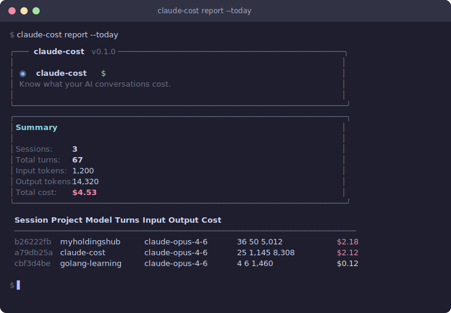

<div align="center">

# claude-cost

**Know what your AI conversations cost.**

[](https://www.npmjs.com/package/claude-cost)
[](https://github.com/rohitdhiman1/claude-cost/blob/main/LICENSE)
[](https://github.com/rohitdhiman1/claude-cost)
[](https://claude.ai/code)
[](https://github.com/rohitdhiman1/claude-cost/pulls)

Track and report Claude Code session costs silently via hooks.
Zero config. Zero noise. Just data when you want it.

<br/>



</div>

---

## Features

- **Silent cost tracking** via Claude Code Stop hook — logs every turn automatically
- **Cost reports** — today, yesterday, week, month, custom date ranges, or all-time
- **Project detection** — intelligently extracts project names from Claude session data
- **Model visibility** — shows exact model used per session
- **Branded CLI output** — clean, elegant terminal formatting with aligned sections
- Zero runtime dependencies

## Install

```bash
npm install -g claude-cost
```

## Quick Start

```bash
# Install the tracking hook (one-time)
claude-cost install

# Use Claude Code normally — costs are logged silently in the background

# Check your spending
claude-cost report --today
```

## Usage

### Reports

```bash
# All-time summary
claude-cost report

# Today's sessions
claude-cost report --today

# Yesterday's sessions
claude-cost report --yesterday

# Past 7 days
claude-cost report --week

# Past 30 days
claude-cost report --month

# Custom range (past N days)
claude-cost report --days 14

# Specific session
claude-cost report --session <id>
```

**Example output:**

```
╭─── claude-cost v0.1.0 ──────────────────────────────────────────────╮
│                                                                     │
│  ◉  claude-cost  $                                                  │
│  Know what your AI conversations cost.                              │
│                                                                     │
╰─────────────────────────────────────────────────────────────────────╯
╭─────────────────────────────────────────────────────────────────────╮
│ Summary                                                             │
│                                                                     │
│ Sessions:      3                                                    │
│ Total turns:   42                                                   │
│ Input tokens:  1,200                                                │
│ Output tokens: 12,000                                               │
│ Total cost:    $3.50                                                │
╰─────────────────────────────────────────────────────────────────────╯

  Session   Project        Model            Turns  Input  Output   Cost
  ─────────────────────────────────────────────────────────────────────
  b26222fb  my-project     claude-opus-4-6     36     50   5,012  $2.18
  a79db25a  claude-cost    claude-opus-4-6     25  1,145   8,308  $2.12
```

### Hook Management

```bash
# Install Stop hook into ~/.claude/settings.json
claude-cost install

# Remove hook
claude-cost uninstall
```

## How It Works

1. `claude-cost install` registers a Stop hook in `~/.claude/settings.json`
2. Every time Claude Code completes a turn, the hook fires silently
3. The hook reads the transcript, extracts token usage, calculates cost, and appends to JSONL storage
4. `claude-cost report` reads the stored data and displays formatted summaries

## Pricing

Based on current Claude API pricing (as of May 2025):

| Model | Input (per MTok) | Output (per MTok) | Cache Write | Cache Read |
|-------|-----------------|-------------------|-------------|------------|
| Opus 4.5/4.6/4.7 | $5.00 | $25.00 | 1.25x input | 0.1x input |
| Sonnet 4.5/4.6 | $3.00 | $15.00 | 1.25x input | 0.1x input |
| Haiku 4.5 | $1.00 | $5.00 | 1.25x input | 0.1x input |

## Data Storage

Session cost data is stored as JSONL files in `~/.claude-cost/sessions/`. Each session gets its own file with one JSON record per turn.

**Important:** Cost tracking only records data going forward from when `claude-cost install` is run. It cannot retroactively capture past sessions — Claude Code does not expose historical usage data.

## Development

```bash
# Install dependencies
npm install

# Build
npm run build

# Run tests
npm test

# Type check
npm run lint
```

After code changes, only `npm run build` is needed — the npm-linked binary points to `dist/cli.js` directly.

## License

MIT
